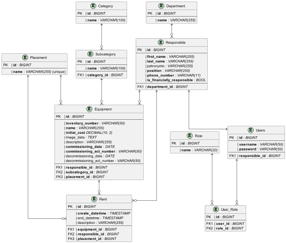

# Дипломная работа "Автоматизированная система учета материально-технического обеспечения университета"

## ER-Диаграмма

- NOT NULL поля сущностей выделены **полужирным** начертанием
- Тип данных поля указан после двоеточия *курсивным* начертанием 